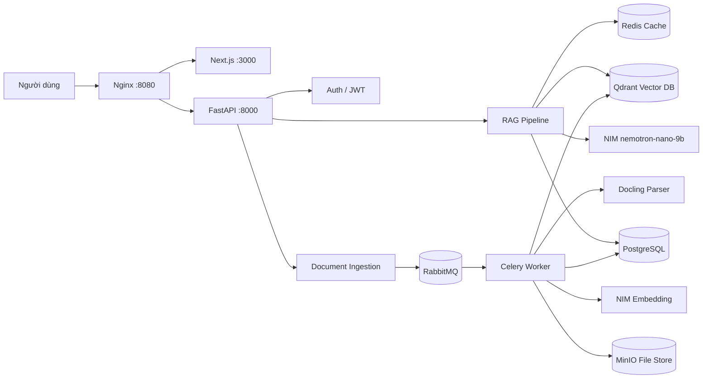
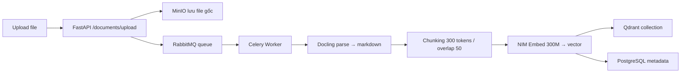
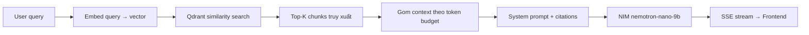

<div align="center">

# NTC Local Knowledge

**Nền tảng chatbot RAG nội bộ — hỏi đáp tài liệu với bằng chứng có kiểm chứng, chạy hoàn toàn trên hạ tầng NVIDIA local.**

[Tổng quan](#tổng-quan) •
[Kiến trúc](#kiến-trúc) •
[Pipeline RAG](#pipeline-rag) •
[Vận hành](#vận-hành) •
[Cấu hình](#cấu-hình-và-secret)


</div>

---

## Tổng quan

Repository này là workspace production cho chatbot RAG chạy local trên NVIDIA DGX Spark/GB10. Hệ thống không chỉ đơn thuần gọi LLM, mà tổ chức đầy đủ pipeline để trả lời có căn cứ: upload tài liệu, parse, chunk, embedding, lưu vector, truy xuất, gom context theo ngân sách token, stream phản hồi và lưu lại kết quả.

**Các runtime chính:**

- `apps/api`: FastAPI điều phối auth, document ingestion, RAG pipeline, chat history.
- `apps/web`: Next.js cho giao diện chat, quản lý tài liệu (Thư mục File).
- `apps/worker`: Celery worker xử lý document bất đồng bộ qua RabbitMQ.
- `postgres`, `qdrant`, `redis`, `minio`, `rabbitmq`: lớp dữ liệu, vector, cache, queue và object storage.
- `nginx`: reverse proxy và gateway duy nhất.
- NIM (external): `nemotron-nano-9b-v2` cho LLM inference, `llama-nemotron-embed-300m-v2` cho embedding.

**Mô hình hiện tại:**

| Vai trò | Model | Framework |
|---------|-------|-----------|
| LLM inference | `nvidia/nemotron-nano-9b-v2` | NVIDIA NIM |
| Embedding | `nvidia/llama-nemotron-embed-300m-v2` | NVIDIA NIM |

---

## Kiến trúc



Thiết kế tách service theo trách nhiệm. API là orchestrator, worker xử lý document nặng bất đồng bộ, còn NIM inference chạy trên external Docker network riêng để tránh xung đột GPU.

---

## Module Matrix

| Module | Vai trò | Điểm cần biết khi sửa |
|--------|---------|----------------------|
| `apps/api/app/api/documents.py` | HTTP endpoint upload/list/delete tài liệu | Gọi ingestion queue bất đồng bộ, trả 202 Accepted |
| `apps/api/app/application/rag.py` | RAG pipeline: retrieval + citation + LLM | System prompt + citation validation; model format ảnh hưởng chất lượng |
| `apps/api/app/infrastructure/ingestion.py` | Celery queue producer | Retry logic 3 lần; warmup connection khi khởi động |
| `apps/worker/worker/tasks.py` | Celery task `process_document` | Entry point xử lý từng document |
| `apps/worker/worker/parsers/__init__.py` | Docling document converter | `do_ocr=False` để tăng tốc; bật lại nếu cần scan PDF |
| `apps/web/app/components/sidebar.tsx` | Sidebar: Thư mục File + upload | Upload validation 500MB; gọi `apiUploadDocument()` |
| `apps/web/app/lib/api.ts` | Frontend API client | Decode JWT → inject `X-NTC-Tenant-ID`, `X-NTC-User-ID` |
| `infra/nginx/nginx.conf` | Reverse proxy gateway | `client_max_body_size 500m`; proxy timeout 600s |

---

## Pipeline RAG

### 1. Upload và index tài liệu



Luồng upload bất đồng bộ: API nhận file → lưu MinIO → đẩy task queue → worker parse và index. Frontend poll trạng thái qua `GET /documents/`.

### 2. Truy vấn RAG



Model trả lời với citations dạng `[S1]`, `[S2]`... tương ứng với chunk nguồn. Citation validator kiểm tra format trước khi gửi về client.

### 3. Token Budget

| Biến | Giá trị | Vai trò |
|------|---------|---------|
| `LLM_CONTEXT_WINDOW` | 4,096 | Context window của nemotron-nano |
| `LLM_MAX_TOKENS` | 1,000 | Output tối đa |
| Chunk size | 300 tokens | Kích thước mỗi chunk document |
| Chunk overlap | 50 tokens | Overlap giữa các chunk liền kề |

> Xem chi tiết: [report.md](report.md)

---

## Vận hành

### Yêu cầu môi trường

- Linux ARM64 (NVIDIA DGX Spark/GB10) với Docker Engine + NVIDIA Container Toolkit
- CPython `>=3.14,<3.15` + [`uv`](https://docs.astral.sh/uv/)
- Node.js `>=22.13,<23` + pnpm `10.32.0`
- NIM services đang chạy trên external network `ntc-rag-phase3_runtime`

### Khởi động nhanh

```bash
# 1. Setup secrets
make phase2-secrets

# 2. Pull images
make phase2-images

# 3. Khởi động toàn bộ stack
docker compose --profile core --profile app up -d

# 4. Apply database migrations
make migrate

# 5. Kiểm tra trạng thái
docker compose --profile core --profile app ps
```

Hoặc dùng script tổng hợp:

```bash
bash ./start.sh
```

### Endpoints chính

| URL | Service |
|-----|---------|
| `http://localhost:3000` | Web UI (Next.js) |
| `http://localhost:8000` | API trực tiếp (FastAPI) |
| `http://localhost:8080` | Gateway (Nginx) |
| `http://localhost:8000/health/live` | API liveness |
| `http://localhost:8000/docs` | Swagger UI |

### Dừng stack

```bash
# Dừng nhưng giữ dữ liệu
docker compose --profile core --profile app down

# CẢNH BÁO: Lệnh này XÓA toàn bộ dữ liệu
# docker compose --profile core --profile app down --volumes
```

---

## Compose Profiles và Topology

| Profile | Service | Vai trò |
|---------|---------|---------|
| `core` | PostgreSQL, Redis, RabbitMQ, MinIO, Qdrant | Datastores |
| `app` | API, Worker, Web, Nginx | Application stack |
| `observability` | DCGM, Prometheus, Grafana | Monitoring GPU |
| `dev` | Mailpit | SMTP dev sink |

---

## Cấu hình và Secret

Credential không nằm trong `.env`. Secrets được tạo qua:

```bash
make phase2-secrets
```

File được lưu tại `.secrets/` và bị Git ignore. Không đặt credential vào `.env`, process argument hoặc biến `NEXT_PUBLIC_*`.

Các biến môi trường quan trọng:

| Biến | Ví dụ | Vai trò |
|------|-------|---------|
| `APP_NIM_LLM_BASE_URL` | `http://172.21.0.2:8000/v1` | Endpoint LLM NIM |
| `APP_NIM_LLM_MODEL` | `nvidia/nemotron-nano-9b-v2` | Model LLM |
| `APP_NIM_EMBED_BASE_URL` | `http://172.21.0.3:8000/v1` | Endpoint Embedding NIM |
| `INGESTION_MAX_FILE_SIZE` | `524288000` | Upload limit (500MB) |

---

## Cấu trúc Repository

```text
apps/
├── api/          FastAPI backend, RAG pipeline, NIM adapters
├── web/          Next.js frontend, chat UI, sidebar document library
└── worker/       Celery worker, Docling parser, chunker
infra/
├── nginx/        Gateway config (500m upload, 600s timeout)
├── grafana/      Dashboard GPU + system
├── prometheus/   Scrape config
├── rabbitmq/     Message broker config
└── redis/        Cache config
docs/
├── adr/          Architecture Decision Records
├── architecture/ Chi tiết kiến trúc từng phase
└── model-inventory.md
migrations/       Alembic schema migrations
packages/         Shared contracts và utilities
scripts/          Automation scripts
tests/            Integration và acceptance tests
compose.yaml      Stack chính (core + app + observability)
compose.phase3.yaml  NIM external runtime topology
```

---

## Tài liệu

- [Architecture Decision Records](docs/adr/)
- [Model Inventory](docs/model-inventory.md)
- [Token Management Report](report.md)
- [Contributing Guide](CONTRIBUTING.md)
- [Phase 2 Infrastructure](docs/architecture/phase-2-infrastructure.md)
- [Phase 5 Retrieval](docs/architecture/phase-5-retrieval.md)
