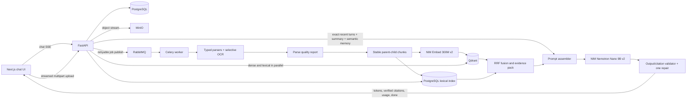

# Chatbot architecture after quality optimization

Snapshot: 2026-07-17. This document describes the code and the active
`km-taskchatbot` Compose deployment after applying `plan.md`.

## Chat request path

1. The API authorizes the user and conversation; memory values never come from the
   untrusted HTTP body.
2. User and assistant messages are persisted independently of the optional enhanced
   memory flag. Exact recent turns are packed using the hash-bound Nemotron tokenizer.
3. Rolling summary, tenant/user-scoped semantic memory and conversation-active document
   IDs are restored when enabled.
4. With active documents, dense Qdrant and PostgreSQL lexical retrieval run in parallel
   and are fused with reciprocal-rank fusion. A normal prompt-only request bypasses
   document retrieval; an explicit file/document reference (for example `file mse`) is
   treated as a corpus-wide search even when no file is attached in the composer.
5. Context is packed after output and safety reservations. Nemotron receives either the
   dedicated general-chat prompt or the grounded RAG prompt.
6. Output is buffered, checked for hidden reasoning and invalid citations, repaired at
   most once, then emitted. The assistant message and redacted generation trace are saved
   before the terminal `done` event.

## Upload and indexing path

The API spools multipart content instead of keeping an unconditional full-file copy,
streams the object to MinIO, writes the document/version records and publishes a task with
bounded retries. The worker parses according to type, uses native PDF text first and OCR
only when coverage is below 90%, writes a parse-quality report, creates deterministic
parent/child chunk IDs, embeds in bounded batches and updates both vector and lexical
indexes. Page, slide, sheet/cell-range and source-code line metadata survive the entire
path.

## Isolation and failure behavior

- Every document, retrieval and memory operation is scoped by trusted tenant/user/ACL
  values.
- Stable citation IDs are derived from immutable chunk UUIDs, not model output order.
- Unknown or malformed citations and hidden reasoning fail closed.
- The unsafe final-answer cache is disabled because the previous key did not bind memory,
  document versions, prompt version or retrieval policy.
- RabbitMQ, PostgreSQL, Redis, MinIO, Qdrant, API, worker, web and reverse proxy are healthy
  in the active stack at this snapshot.

## Known architectural limits

Grounded responses are not true token-streaming yet; validation happens before visible
output. Reranking is intentionally off pending a held-out quality win. Hierarchical
document summaries/map-reduce for very long files and a complete admin latency dashboard
remain follow-up work.
