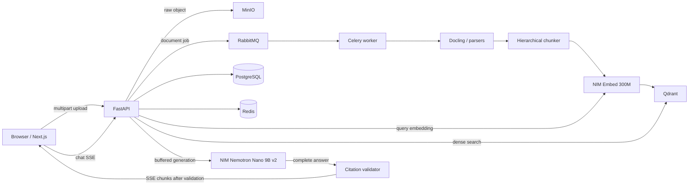

# Chatbot architecture before quality optimization

Snapshot: 2026-07-17.

Important properties of the current flow:

- Upload is asynchronous after API acceptance, but the API and worker each load the
  entire file into memory on their respective paths.
- Retrieval is dense-only. The reranking adapter exists but is disabled in the live
  policy.
- The model streams internally, but the graph buffers the full answer until citation
  validation finishes. End users therefore do not receive true token TTFT.
- Conversation/message support exists partially in source, but the live database schema
  and repository contract have drifted and runtime still has no persisted messages.
- The NIM runtime is capable of 131072 tokens, while the application policies use a
  32768-token window with smaller evidence caps.

